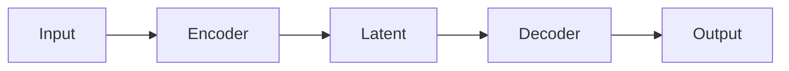

# Paper Summaries

A shared space to read and contribute research paper summaries. Browse what others have written, add your own notes, or edit existing ones — no setup needed.

---

## Reading a summary

Click any file in the left sidebar to open it. The list is sorted alphabetically; use the **search bar** at the top of the sidebar to filter by name as you type.

Files are organised as `topic/paper-name.md` — the folder prefix is just for grouping, you can ignore it.

---

## Navigating between papers

- **Sidebar** — always visible on desktop, tap the ☰ icon on mobile to open it
- **Browser back/forward** — works as expected; each paper has its own URL (`?file=topic/paper.md`) you can bookmark or share with a colleague
- **Search** — filters the file list live as you type; clears when you close the sidebar

---

## Writing or editing a summary

Switch between **Preview** and **Edit** using the tabs in the top-right corner.

In Edit mode you get a split view: the raw Markdown on the left updates the preview on the right as you type.

**Saving** — hit `Ctrl+S` (or `Cmd+S` on Mac), or click the **Save** button. An unsaved change shows a small ● indicator next to the button. Saves go directly to the shared folder, so everyone sees your changes immediately on next load.

### Creating a new file

Click **New** in the sidebar. Enter a name like `transformers/attention-is-all-you-need` — the `.md` extension is added for you. Subfolders are created automatically, so you can use `/` to organise by topic or year.

---

## Writing Markdown

If you haven't used Markdown before, here's everything you'll actually need:

```
# Big heading
## Section heading
### Subsection

Normal paragraph text. **bold**, *italic*, `inline code`.

- Bullet point
- Another one

1. Numbered
2. List

> Blockquote — good for pulling out key quotes from a paper

[link text](https://arxiv.org)
```

---

## Math

Write equations the same way you would in LaTeX.

Inline: wrap with `$...$` — e.g. `$L = \frac{1}{N} \sum_i \ell_i$`

Display (centred block): wrap with `$$...$$`

$$
\text{Attention}(Q, K, V) = \text{softmax}\!\left(\frac{QK^\top}{\sqrt{d_k}}\right)V
$$

---

## Diagrams

You can draw flow diagrams using [Mermaid](https://mermaid.js.org/syntax/flowchart.html) syntax inside a fenced code block:

~~~

~~~

---

## Light and dark mode

Click the ☀ / 🌙 button in the top-right corner to toggle. Your preference is remembered across sessions.

---

## A few things to keep in mind

- **Only `.md` files are shown.** Other files in the folder (PDFs, notebooks, etc.) won't appear here.
- **Saves are immediate and shared.** There's no version history in this interface — if you overwrite something important, the file on disk is your source of truth.
- **File names become the page title.** Hyphens and underscores are replaced with spaces and title-cased, so `attention-is-all-you-need.md` shows as *Attention Is All You Need* in the tab and header.
